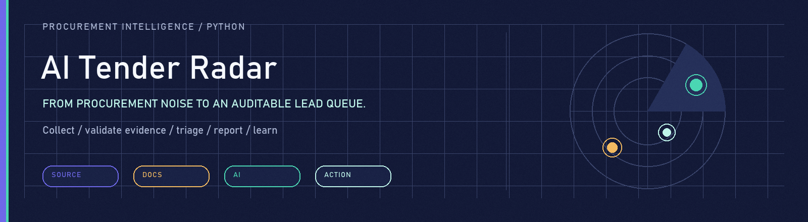
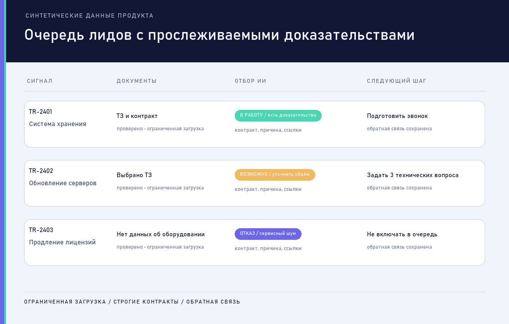

<p align="center">
  
</p>

# AI Tender Radar

**Procurement intelligence pipeline that turns a noisy purchase feed into an auditable lead queue.**

[](https://github.com/pavel-logachev/ai-tender-radar/actions/workflows/quality.yml)
[](https://www.python.org/)
[](docs/VERIFICATION.md)
[](LICENSE)

AI Tender Radar is an independent production engineering project for procurement signal collection, bounded document acquisition, LLM lead triage, report generation and human feedback. The public repository contains the application core, contracts, migrations, tests and sanitized infrastructure examples. Production credentials, customer data, private operational history and raw vendor documentation are not included.

**Product case:** https://logachev.net/portfolio/tender-radar/

## Product loop

1. Collect and normalize procurement signals.
2. Apply cheap safety gates and eliminate obvious noise.
3. Use an LLM to triage candidates that deserve deeper work.
4. Plan and execute bounded document acquisition with rate-limit protection.
5. Validate and extract technical evidence before report generation.
6. Deliver a lead queue to Telegram or Excel and capture human feedback.

<p align="center">
  <picture>
    <source media="(max-width: 720px)" srcset="docs/assets/ai-tender-radar-product-mobile.png" />
    
  </picture>
</p>

> The product image uses synthetic records. No production tenders, contacts, customer reports or credentials are published.

## Why this is not a keyword scraper

The code separates semantic work from deterministic execution:

- **LLM:** lead triage, document planning, evidence interpretation and customer-lead reporting;
- **code:** collection, normalization, hard-noise gates, download limits, validation, retries, persistence, delivery and audit trails.

Rules remain useful for safety and cheap filtering. They do not replace semantic analysis where the purchase subject, documents and commercial context require reasoning.

## Architecture

- **Sources** — bounded adapters, search profiles and normalized source records.
- **Acquisition** — safe HTTP boundary, archive handling, format validation and `429` protection.
- **Evidence** — document extraction, technical-spec detection and primary-document selection.
- **Intelligence** — strict Pydantic contracts, provider boundary, triage evaluation and report generation.
- **Workflow** — PostgreSQL state, idempotent jobs, Telegram queue, Excel export and feedback.
- **Operations** — migrations, health checks, structured diagnostics and CI.

See [docs/ARCHITECTURE.md](docs/ARCHITECTURE.md) for the component boundaries and failure model.

## Verification

The clean-room public tree was exercised in an isolated Python 3.12 environment:

- dependency resolution and `pip check`;
- source compilation;
- migration dry-run and clean PostgreSQL bootstrap in CI;
- **579 unit and contract tests**;
- full-history secret scan;
- public-boundary scan.

```bash
python -m venv .venv
. .venv/bin/activate
python -m pip install \
  --upgrade pip
python -m pip install \
  -r requirements.lock
python -m pip check
python -m compileall -q \
  app scripts tests
python \
  scripts/apply_migrations.py \
  --dry-run
python -m unittest discover
```

Windows activation:

```text
.venv\Scripts\activate
```

The tests use mocks and synthetic fixtures. They do not require production credentials or live source access.

## Configuration

Copy `.env.example` to `.env` and supply credentials only for services you are authorized to use. `.env` is ignored by Git.

The checked-in YAML profiles are sanitized examples for an infrastructure procurement vertical. They are not a production customer profile and do not contain customer contacts or private account data.

## Repository map

- `app/collector/` — source and document acquisition boundaries;
- `app/llm/` — provider clients, contracts and report generation;
- `app/pipeline/` — shortlist, preparation and orchestration;
- `app/platform/` — durable jobs, profile packs, contracts and versioning;
- `app/evaluation/` — lead-triage evaluation;
- `config/` — sanitized qualification and search profiles;
- `database/` — checksum-bound legacy baseline and additive migrations;
- `tests/` — unit, contract and failure-path coverage;
- `tools/` — publication boundary and visual-asset tooling.

## Public boundary

This repository is a clean-room publication, not a mirror of the private production Git history. It intentionally excludes:

- credentials, tokens, chat IDs and proxy credentials;
- production databases, run logs and downloaded documents;
- real customer leads, reports, contacts and feedback;
- internal agent memory, commercial/GTM materials and incident notes;
- deployment host aliases and rollback artifacts;
- raw third-party Swagger snapshots.

The exact boundary is documented in [docs/PUBLICATION_BOUNDARY.md](docs/PUBLICATION_BOUNDARY.md).

## Status and limits

- The architecture is used by an independently operated production contour.
- This repository is not a hosted SaaS and does not expose the production environment.
- Source access depends on the terms and credentials of the selected procurement provider.
- Search and qualification profiles must be validated for each business vertical.
- LLM outputs require contracts, evidence checks and human review; they are not procurement or legal advice.

## License

Application code in this public repository is licensed under [GNU AGPL v3](LICENSE). This choice is compatible with the published PyMuPDF-backed extraction path. Dependency licenses are summarized in [THIRD_PARTY_NOTICES.md](THIRD_PARTY_NOTICES.md).

Security reports: [SECURITY.md](SECURITY.md). Contributions: [CONTRIBUTING.md](CONTRIBUTING.md).
