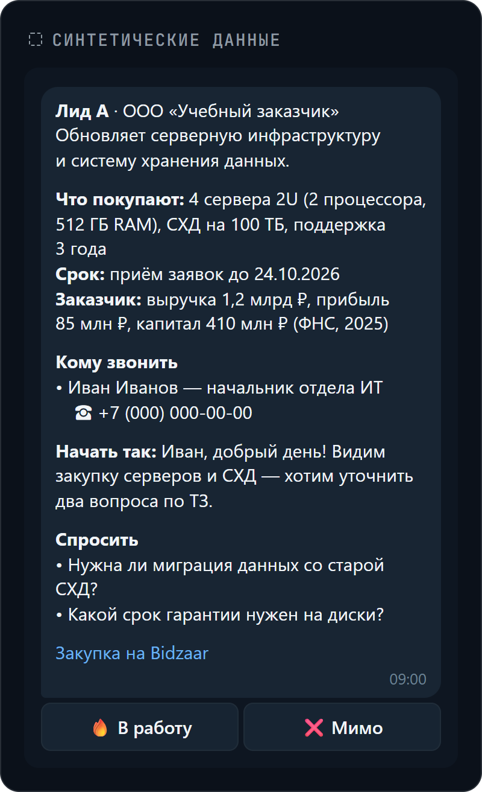
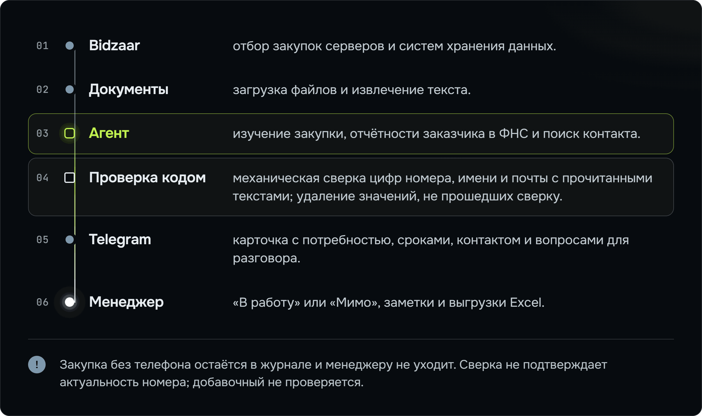

<picture><source media="(max-width: 767px)" srcset="docs/assets/ai-tender-radar-banner-mobile.png"></picture>

# AI Tender Radar

**AI Tender Radar находит закупки серверов и систем хранения данных на Bidzaar и присылает менеджеру в Telegram карточку для звонка: что покупают, к какому сроку и с кем связаться.**

[Статья о проекте](<https://logachev.net/journal/ii-agent-dlya-generacii-lidov-zakupki/>) · [Архитектура](<docs/ARCHITECTURE.md>) · [Что опубликовано](<docs/PUBLICATION_BOUNDARY.md>) · [Проверка](<docs/VERIFICATION.md>)

## Что получает менеджер

Карточку на один экран:

- **Потребность:** оборудование, количество и сроки по техническому заданию, а не по заголовку закупки.
- **Заказчик:** выручка, прибыль и капитал за последний опубликованный год по отчётности ФНС.
- **Контакт:** телефон, а если найден конкретный человек — его имя и роль.
- **Начало разговора:** с чего начать звонок и какие вопросы задать по документам.

В Telegram попадают только карточки с телефоном, прошедшим механическую сверку цифр с прочитанными текстами. Это может быть номер конкретного человека, отдела или приёмной.



*Синтетический макет карточки, которую менеджер получает в Telegram: данные вымышлены, это не скриншот рабочей системы.*

Менеджер отмечает «В работу» или «Мимо», сохраняет заметку ответом на карточку и выгружает в Excel новые лиды или лиды в работе.

## Как это работает

Агент читает закупку и документы, изучает отчётность заказчика в ФНС и ищет контакт: сначала в самой закупке и её документах, затем на сайте заказчика и в открытых источниках. Он сам решает, какие файлы и страницы открыть и когда остановить поиск.

Код ограничивает число шагов и расходы на модель. Перед сохранением результата [проверка контактов](<agent_radar/lead_agent/grounding.py>) механически сверяет цифры номера, имя и почту с текстами, которые агент действительно прочитал. Проверка отсекает номера, чьё 10-значное ядро не найдено в слитной последовательности цифр этих текстов; имя и почта удаляются, если не проходят свою сверку. Журнал и доставка в Telegram тоже работают в коде.

<picture><source media="(max-width: 767px)" srcset="docs/assets/ai-tender-radar-how-it-works-mobile.png"></picture>

Подробности, включая версии закупок, повторные отправки и обработку сбоев, — в [архитектуре](<docs/ARCHITECTURE.md>).

## Почему агент, а не цепочка кода

В первой версии документы проходили через модель по заранее заданным шагам. Каждый новый случай требовал ещё одной ветки в программе. Агент сам выбирает, что читать и где продолжать поиск; правила исследования задаются инструкцией.

На одном и том же наборе из **16 закупок** человека с проверенным по источникам телефоном нашли:

- прежняя цепочка кода — **в 3 случаях**;
- агент — **в 8–9 случаях**, в зависимости от модели.

Это результат одного прогона рабочей системы, зафиксированный в её документации, а не обещание такой же результативности на новых закупках. Исходный набор не опубликован. Публичные тесты проверяют поведение кода на синтетических данных и не воспроизводят это сравнение.

## Что опубликовано, а что закрыто

**Опубликовано:**

- [Исследовательское ядро](<agent_radar/lead_agent/README.md>): агент, инструменты, проверка контактов, карточки и журнал.
- Обработка документов, доставка в Telegram, решения менеджера, заметки и Excel.
- Синтетические тесты, CI, документация и [универсальный пример промпта](<agent_radar/lead_agent/prompt.md>).

**Не опубликовано:** коннектор площадки, оркестрация получения данных, боевой промпт и рабочее развёртывание. Также исключены реальные закупки и контакты, рабочие базы и секреты.

Это код для изучения и собственной интеграции, а не готовая копия рабочего сервиса. Состав открытой и закрытой частей описан в [границе публикации](<docs/PUBLICATION_BOUNDARY.md>).

[app/](<app/>), [database/](<database/>) и корневой [Dockerfile](<Dockerfile>) — остановленное первое поколение. Оно не участвует в текущем исследовательском потоке, но его тесты и миграционные проверки сохранены в CI.

Граница публикации относится к текущему дереву: в старой публичной истории остались необезличенные значения. Подробнее — в [протоколе проверки истории Git](<docs/VERIFICATION.md#ранее-опубликованная-история>).

## Запуск проверок

Нужны **Python 3.12** и PowerShell. Выполняйте команды из корня репозитория:

```powershell
python -m venv .venv
.\.venv\Scripts\Activate.ps1
python -m pip install -r requirements.lock -r requirements-dev.txt
python -m pip check
$env:PYTHONUTF8='1'
python tools/check_public_boundary.py
python -m compileall -q app agent_radar scripts tests tools
python -m unittest discover -s tests -p "test_agent_radar_*.py"
python -m unittest discover
python scripts/apply_migrations.py --dry-run
```

В Linux окружение активируется командой `source .venv/bin/activate`.

В [протоколе от 05.10.2026](<docs/VERIFICATION.md>) зафиксирован прогон **726 тестов**: 10 пропусков на Windows и 4 на Linux. Тесты не вызывают модель и не обращаются к живым источникам.

Проверки не запускают рабочий сервис. Для собственного исследования нужны пакет `analysis-source.json` с карточками и текстами документов, ключ провайдера модели и настроенный промпт. Telegram подключается к существующему приложению через адаптер. [Формат данных и запуск исследователя](<agent_radar/lead_agent/README.md>).

## Ограничения

- **Телефон проверен по тексту, а не звонком.** Совпадение цифр и имени с источником не доказывает, что номер принадлежит этому человеку или ещё работает.
- **У сверки телефона возможны ложные совпадения.** Код ищет 10-значное ядро номера в слитной последовательности всех цифр прочитанных текстов. Совпадение может случайно сложиться из соседних чисел: оно не гарантирует, что номер присутствует в тексте именно как телефон. Добавочный номер не проверяется и может сохраниться, даже если модель его придумала.
- **Это не полный реестр закупок Bidzaar.** Источник хранит ограниченное окно изменений.
- **Не все документы можно прочитать.** Поддерживаются PDF, DOCX, DOC, XLSX, TXT, ZIP и 7z. OCR, RAR и XLS не поддерживаются. Для DOC нужен `antiword`, для 7z — внешний `7zz` или `7z`.
- Недоступный или нечитаемый файл отмечается как пробел в данных. Недоверенные документы нужно обрабатывать в отдельном процессе без сети и с лимитами ресурсов.
- Веб-поиск использует необязательный пакет `ddgs`; без него инструмент сообщает, что поиск недоступен.
- **Система не звонит и не пишет заказчикам.** Контакт и следующий шаг проверяет менеджер.

## Лицензия и автор

Код распространяется по [AGPL-3.0](<LICENSE>). Лицензии зависимостей — в [THIRD_PARTY_NOTICES.md](<THIRD_PARTY_NOTICES.md>).

Автор — [Павел Логачев](<https://logachev.net/>). Связаться: [ai@logachev.net](<mailto:ai@logachev.net>).
